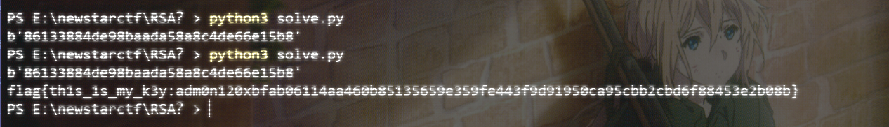
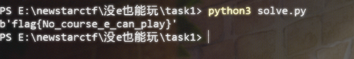

# NewStar CTF Week5 WriteUp

> Date: 10/28/2024 Author: 夏槿 中山大学网络空间安全学院 23366091 郑梓炫
>
> 这周太多ddl了，做不完根本做不完。

# Crypto

## easy_ecc

推导一下式子就解出来了

``` python
from Crypto.Util.number import * # type: ignore
# from secret import flag

p = 64408890408990977312449920805352688472706861581336743385477748208693864804529
a = 111430905433526442875199303277188510507615671079377406541731212384727808735043
b = 89198454229925288228295769729512965517404638795380570071386449796440992672131
E = EllipticCurve(GF(p),[a,b])
k = 86388708736702446338970388622357740462258632504448854088010402300997950626097
# K = k * G
# r = getPrime(256)
# c1 = m + r * K
# c2 = r * G

c1 = E(10968743933204598092696133780775439201414778610710138014434989682840359444219 , 50103014985350991132553587845849427708725164924911977563743169106436852927878 , 1)
c2 = E(16867464324078683910705186791465451317548022113044260821414766837123655851895 , 35017929439600128416871870160299373917483006878637442291141472473285240957511 , 1)

m = c1-k*c2

c_left = 15994601655318787407246474983001154806876869424718464381078733967623659362582
c_right = 3289163848384516328785319206783144958342012136997423465408554351179699716569

c_left = c_left//m[0]

c_right = c_right //m[1]

print(c_left)
print(c_right)

# print(long_to_bytes(c_left))

# c_left =bytes_to_long(flag[:len(flag)//2]) * m[0]
# c_right = bytes_to_long(flag[len(flag)//2:]) * m[1]


# print(f"c1 = {c1}")
# print(f"c2 = {c2}")
# print(f"cipher_left = {c_left}")
# print(f"cipher_right = {c_right}")


# '''
# c1 = (10968743933204598092696133780775439201414778610710138014434989682840359444219 : 50103014985350991132553587845849427708725164924911977563743169106436852927878 : 1)
# c2 = (16867464324078683910705186791465451317548022113044260821414766837123655851895 : 35017929439600128416871870160299373917483006878637442291141472473285240957511 : 1)
# c_left = 15994601655318787407246474983001154806876869424718464381078733967623659362582
# c_right = 3289163848384516328785319206783144958342012136997423465408554351179699716569
# '''

# --- 


from Crypto.Util.number import * # type: ignore


num1 = 531812496965563174412251588431148136
num2 = 526357398425538015765092604513836925

print(long_to_bytes(num1))
print(long_to_bytes(num2))

# flag{This_is_the_last_crypto_}
```


## RSA?

正难则反，你不是知道e了嘛，用d加密，那么就用e解密。

然后md5爆破。

``` python
from Crypto.Util.number import *
from gmpy2 import *
import hashlib

s = 5461514893126669960233658468203682813465911805334274462134892270260355037191167357098405392972668890146716863374229152116784218921275571185229135409696720018765930919309887205786492284716906060670649040459662723215737124829497658722113929054827469554157634284671989682162929417551313954916635460603628116503

e = 65537

n = 139458221347981983099030378716991183653410063401398496859351212711302933950230621243347114295539950275542983665063430931475751013491128583801570410029527087462464558398730501041018349125941967135719526654701663270142483830687281477000567117071676521061576952568958398421029292366101543468414270793284704549051

m = pow(s,e,n)

print(long_to_bytes(m))

# 86133884de98baada58a8c4de66e15b8

# https://www.cmd5.com/

# adm0n12


mm = 'adm0n12'

def get_flag(m0):  # 请用这个函数来转m得到flag
    import hashlib
    flag = 'flag{th1s_1s_my_k3y:' + m0 + '0x' + hashlib.sha256(m0.encode()).hexdigest() + '}'
    print(flag)

get_flag(mm)
```



## 没e也能玩

直接copy脚本来用

``` python
c=312026920216195772014255984174463085443866592575942633449581804171108045852080517840578408476885673600123673447592477875543106559822653280458539889975125069364584140981069913341705738633426978886491359036285144974311751490792757751756044409664421663980721578870582548395096887840688928684149014816557276765747135567714257184475027270111822159712532338590457693333403200971556224662094381891648467959054115723744963414673861964744567056823925630723343002325605154661959863849738333074326769879861280895388423162444746726568892877802824353858845944856881876742211956986853244518521508714633279380808950337611574412909
p=108043725609186781791705090463399988837848128384507136697546885182257613493145758848215714322999196482303958182639388180063206708575175264502030010971971799850889123915580518613554382722069874295016841596099030496486069157061211091761273568631799006187376088457421848367280401857536410610375012371577177832001
q=121590551121540247114817509966135120751936084528211093275386628666641298457070126234836053337681325952068673362753408092990553364818851439157868686131416391201519794244659155411228907897025948436021990520853498462677797392855335364006924106615008646396883330251028071418465977013680888333091554558623089051503
dp=11282958604593959665264348980446305500804623200078838572989469798546944577064705030092746827389207634235443944672230537015008113180165395276742807804632116181385860873677969229460704569172318227491268503039531329141563655811632035522134920788501646372986281785901019732756566066694831838769040155501078857473
dq=46575357360806054039250786123714177813397065260787208532360436486982363496441528434309234218672688812437737096579970959403617066243685956461527617935564293219447837324227893212131933165188205281564552085623483305721400518031651417947568896538797580895484369480168587284879837144688420597737619751280559493857

from Crypto.Util.number import *
import gmpy2

I = gmpy2.invert(q,p)

mp = pow(c,dp,p)

mq = pow(c,dq,q)

m = (((mp-mq)*I)%p)*q+mq;


print(long_to_bytes(m))
```



# End

> 完结撒花~